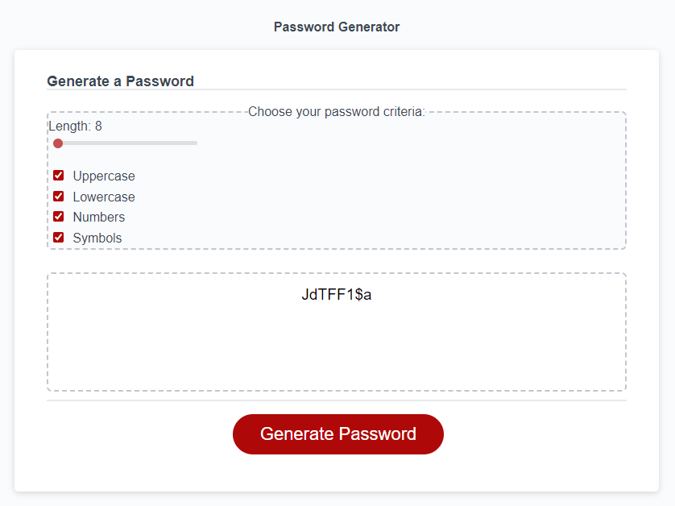

# password-generator

## Description
This website was created Florian Kreuk as part of the UCONN Coding Bootcamp module 3. The purpose of this website is to generate random passwords with the specifications set by the user, utilizing, HTML, CSS, and JS.

The following image demonstrates the web application's appearence:

The following link takes you to the deployed application: [link](https://f-kreuk.github.io/password-generator/)

## Installation
N/A

## Usage
To use this website, simply select Generate Password and utilize the criteria to generate a new password meeting your specifications. 

## Credits
I modeled mine after the LastPass password generator feature. https://lastpass.com/?ac=1&lpnorefresh=1. Picture of an example is seen here: .

For the css reset, I utilized the sample provided in 28-Stu_Mini-Project through the UCONN coding bootcamp.

For the Hide/Show button utilized to display or hide the password criteria, I utilized the below resource/tutorial as a starting place: https://www.w3schools.com/howto/howto_js_toggle_hide_show.asp

For the checkboxes within the password criteria, I utilized the following resource/tutorial as a starting place: https://developer.mozilla.org/en-US/docs/Web/HTML/Element/input/checkbox

For the numerical slider, I utilized the following resource/tutorial as a starting place: https://www.w3schools.com/howto/howto_js_rangeslider.asp

For the function to change a booleon variable value when a checkbox was checked or not, I utilized the following resource/tutorial as a starting place: https://html.form.guide/html-form/html-checkbox-events/

To change the displayed content within the generate password box, I utilized the following resource/tutorial as a starting place: https://www.geeksforgeeks.org/how-to-change-the-content-of-a-textarea-using-javascript/

To generate the random string, I utilized the below tutorial/resource as a starting place: https://www.slingacademy.com/article/ways-to-generate-random-strings-in-javascript/#:~:text=We%20can%20use%20the%20Math,using%20the%20charAt()%20function

## License
Please refer to the LICENSE in repo.

